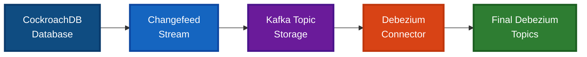
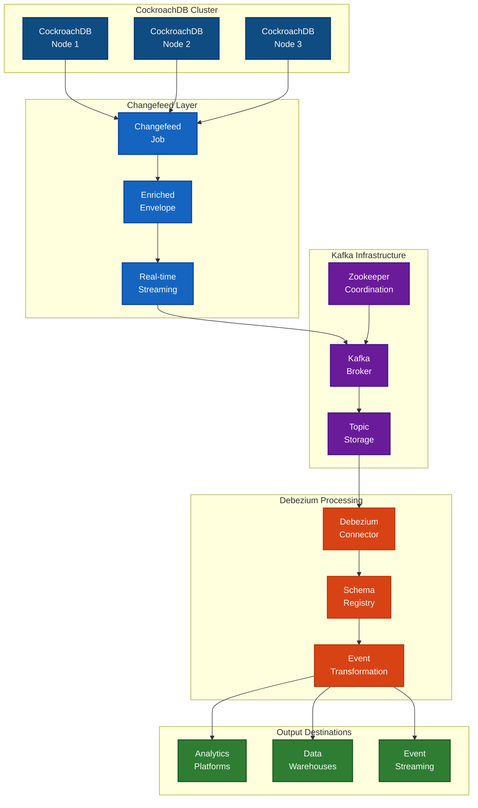
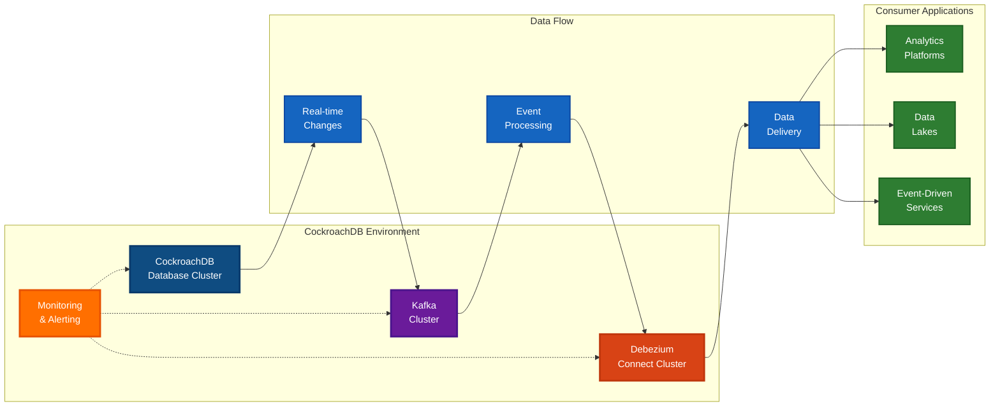
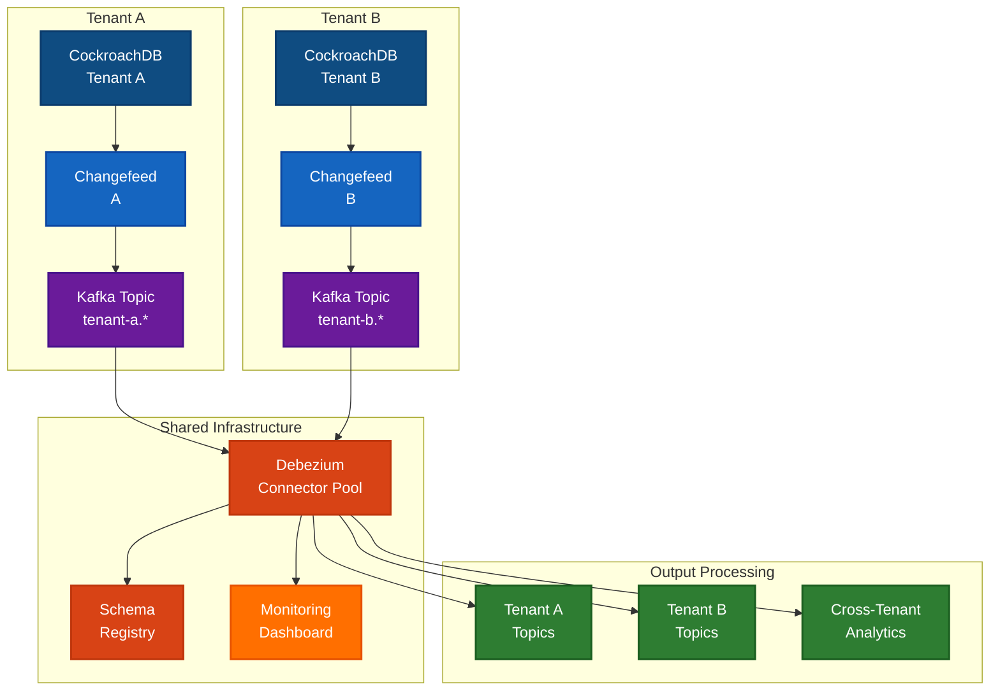
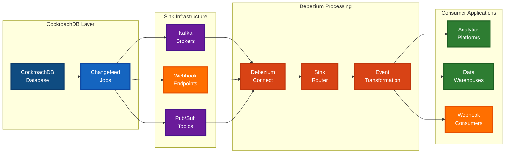

[](LICENSE)
[](https://maven-badges.herokuapp.com/maven-central/io.debezium/debezium-connector-cockroachdb)
[](https://github.com/debezium/debezium-connector-cockroachdb/actions)
[](https://debezium.zulipchat.com/#narrow/channel/510960-community-cockroachdb)

Copyright Debezium Authors.
Licensed under the [Apache License, Version 2.0](http://www.apache.org/licenses/LICENSE-2.0).

# Debezium Connector for CockroachDB

A [Debezium](https://debezium.io/) connector for capturing changes from [CockroachDB](https://www.cockroachlabs.com/) databases.

## Overview

The Debezium CockroachDB connector captures row-level changes from CockroachDB databases and streams them to Apache Kafka topics using Debezium's event processing pipeline. The connector leverages CockroachDB's native [changefeed mechanism](https://www.cockroachlabs.com/docs/v25.2/create-and-configure-changefeeds) for reliable change capture.

**Status**: This connector is currently in incubation phase and is being developed and tested.

## Building CockroachDB Connector

### Prerequisites

* CockroachDB v25.2+ with [rangefeed enabled](https://www.cockroachlabs.com/docs/v25.2/create-and-configure-changefeeds.html#enable-rangefeeds) (enriched envelope support introduced in v25.2)
* Kafka Connect (tested with Debezium Connect 3.0.0.Final)
* JDK 21+
* Maven 3.9.8 or later 
* Docker or Podman Desktop (with podman-compose)

### 1. Build the Connector

```bash
./mvnw clean package -Passembly -DskipTests
# Extract the plugin zip for Docker Compose
unzip -o target/debezium-connector-cockroachdb-3.2.0-SNAPSHOT-plugin.zip -d target/plugin
```

### 2. Start Infrastructure

**Important:** Use the new `start-services.sh` script for reliable service startup:

```bash
# Start all services with correct plugin mounting
./src/test/scripts/start-services.sh
```

This script automatically:
- Calculates the correct absolute path for the plugin directory
- Starts all required services (Zookeeper, Kafka, CockroachDB, Kafka Connect)
- Ensures the connector plugin is properly mounted and discoverable

### 3. Setup CockroachDB

```bash
# Run the setup script to configure CockroachDB with test data
./src/test/scripts/setup-cockroachdb.sh
```

This script will:
- Enable rangefeed (required for changefeeds)
- Create test database and user with proper permissions
- Create a realistic test table with UUID primary key
- Insert sample data for testing

### 4. Deploy the Connector

```bash
curl -X POST http://localhost:8083/connectors \
  -H "Content-Type: application/json" \
  -d @src/test/scripts/configs/cockroachdb-source.json
```

### 5. Consume Change Events

```bash
docker exec -it kafka-test kafka-console-consumer \
  --bootstrap-server localhost:9092 \
  --topic cockroachdb.public.products \
  --from-beginning
```

## Configuration

Example connector configuration:

```json
{
  "name": "cockroachdb-connector",
  "config": {
    "connector.class": "io.debezium.connector.cockroachdb.CockroachDBConnector",
    "database.hostname": "cockroachdb",
    "database.port": "26257",
    "database.user": "testuser",
    "database.password": "",
    "database.dbname": "testdb",
    "database.server.name": "cockroachdb",
    "table.include.list": "public.products",
    "cockroachdb.changefeed.envelope": "enriched",
    "cockroachdb.changefeed.enriched.properties": "source,schema",
    "cockroachdb.changefeed.sink.type": "kafka",
    "cockroachdb.changefeed.sink.uri": "kafka://kafka-test:9092",
    "cockroachdb.changefeed.sink.topic.prefix": "",
    "cockroachdb.changefeed.sink.options": "",
    "cockroachdb.changefeed.resolved.interval": "10s",
    "cockroachdb.changefeed.include.updated": true,
    "cockroachdb.changefeed.include.diff": true,
    "cockroachdb.changefeed.cursor": "now",
    "cockroachdb.changefeed.batch.size": 1000,
    "cockroachdb.changefeed.poll.interval.ms": 100,
    "connection.timeout.ms": 30000,
    "connection.retry.delay.ms": 100,
    "connection.max.retries": 3
  }
}
```

### Configuration Options

#### Database Connection

| Option                 | Default | Description                         |
|------------------------|---------|-------------------------------------|
| `database.hostname`    | -       | CockroachDB host                    |
| `database.port`        | 26257   | CockroachDB port                    |
| `database.user`        | -       | Database user                       |
| `database.password`    | -       | Database password                   |
| `database.dbname`      | -       | Database name                       |
| `database.server.name` | -       | Unique server name for topic prefix |

#### Table Selection

| Option               | Default | Description                               |
|----------------------|---------|-------------------------------------------|
| `table.include.list` | -       | Comma-separated list of tables to monitor |

#### Changefeed Configuration

| Option                                       | Default                | Description                                 |
|----------------------------------------------|------------------------|---------------------------------------------|
| `cockroachdb.changefeed.envelope`            | enriched               | Envelope type: enriched, wrapped, bare      |
| `cockroachdb.changefeed.enriched.properties` | source                 | Comma-separated enriched properties         |
| `cockroachdb.changefeed.sink.type`           | kafka                  | Sink type (kafka, webhook, pubsub, etc.)    |
| `cockroachdb.changefeed.sink.uri`            | kafka://localhost:9092 | Sink URI (format depends on sink type)      |
| `cockroachdb.changefeed.sink.topic.prefix`   | ""                     | Optional prefix for sink topic names        |
| `cockroachdb.changefeed.sink.options`        | ""                     | Additional sink options in key=value format |
| `cockroachdb.changefeed.resolved.interval`   | 10s                    | Resolved timestamp interval                 |
| `cockroachdb.changefeed.include.updated`     | false                  | Include updated column information          |
| `cockroachdb.changefeed.include.diff`        | false                  | Include before/after diff information       |
| `cockroachdb.changefeed.cursor`              | now                    | Start cursor position                       |
| `cockroachdb.changefeed.batch.size`          | 1000                   | Batch size for changefeed processing        |
| `cockroachdb.changefeed.poll.interval.ms`    | 100                    | Poll interval in milliseconds               |

#### Connection Settings

| Option                      | Default | Description                                 |
|-----------------------------|---------|---------------------------------------------|
| `connection.timeout.ms`     | 30000   | Connection timeout in milliseconds          |
| `connection.retry.delay.ms` | 100     | Delay between connection retries in ms      |
| `connection.max.retries`    | 3       | Maximum number of connection retry attempts |

## Event Format

Events are produced in Debezium's enriched envelope format. For details on the changefeed message format, see the [CockroachDB changefeed messages documentation](https://www.cockroachlabs.com/docs/v25.2/changefeed-messages).

```json
{
  "before": null,
  "after": {
    "id": "...",
    "name": "...",
    "...": "..."
  },
  "source": {
    "changefeed_sink": "kafka",
    "cluster_id": "...",
    "database_name": "testdb",
    "table_name": "products",
    "...": "..."
  },
  "op": "c",
  "ts_ns": 1751407136710963868
}
```

## 🏗️ **Architecture**

### **Core Architecture Flow**



### **Detailed Component Architecture**



### **Deployment Architecture**



### **Multi-Tenant Architecture**



## **🔄 Architecture Evolution**

### **Current: Kafka-Centric Architecture**

Our current implementation is optimized for Kafka as the primary sink, providing excellent performance and reliability for Kafka-based data pipelines.


### **Future: Sink-Agnostic Architecture**

We're evolving to a sink-agnostic architecture that supports multiple sink types including Kafka, webhooks, and other destinations.



## Testing

### Automated Tests

Run all unit and integration tests (including Testcontainers-based integration tests):
```bash
./mvnw clean test
```

To run only integration tests:
```bash
./mvnw clean test -Dtest="*IT"
```

### Manual Integration Tests

For manual, end-to-end integration tests using Docker Compose and test scripts, see:
[src/test/scripts/README.md](src/test/scripts/README.md)

This includes:
- How to start the full test environment
- How to run end-to-end and scenario-based tests
- Troubleshooting and log analysis tips

---

For more details, advanced scenarios, and troubleshooting, please refer to the test README above.

## Troubleshooting

- **Permission Errors**: Ensure [CHANGEFEED and SELECT privileges](https://www.cockroachlabs.com/docs/v25.2/grant#supported-privileges) are granted on all monitored tables.
- **Rangefeed Disabled**: Enable with `SET CLUSTER SETTING kv.rangefeed.enabled = true;`
- **No Events**: Check connector logs and [changefeed job status](https://www.cockroachlabs.com/docs/v25.2/monitor-and-debug-changefeeds.html#monitor-a-changefeed).
- **Configuration Issues**: Verify all required [changefeed parameters](https://www.cockroachlabs.com/docs/v25.2/create-and-configure-changefeeds#parameters) are properly configured.
